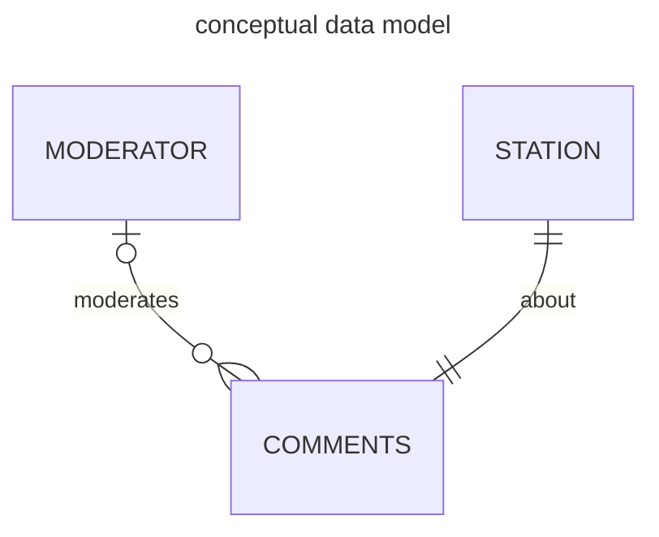
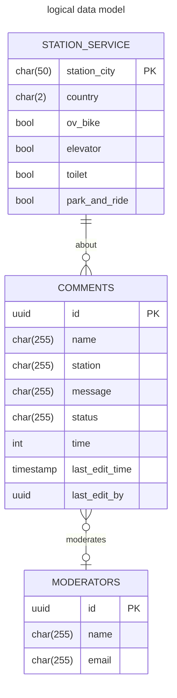
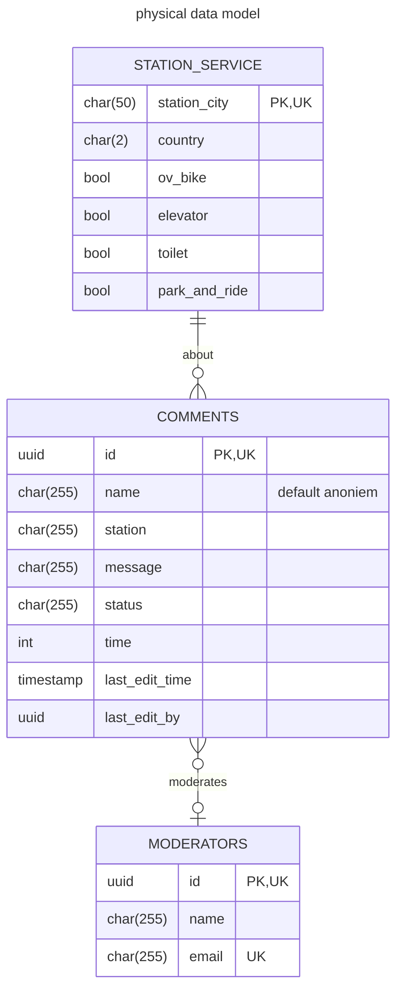

## station zuil
this is an projct for school.

there are 3 programs;

zuil:
here the users can enter their comment about the station and saves this info to an csv

moderation:
here the comments read from the csv and are censored by an human and uploaded to the database

screen:
The screen fetches the comments weather and the facilities on the station. It shows this in a nice GUI 


## setup
0. install python3 and pip and docker and docker compose
1. create a virtual env by running `python -m venv ./.venv`
2. activate the virtual env, you can do this on *NIX systems by running `source ./bin/activate` and on windows by deleting windows and downloading linux
3. once the virtual env is activated install the pip packages by running `pip install -r requirements.txt`
4. run this and change the variables .env 
```
cat << EOF
DBHOST=localhost
DBPORT=5432
DBNAME=docker
DBUSER=docker
DBPASSWORD=example
OPENWEATHER_API_KEY=key EOF > .env
```
5. run `cd database; docker compose up --build` and keep this open while you are working with the program

congrats everthing is now setup, you can run any program by running `python ./src/<program>.py`

if you got the error 
`ModuleNotFoundError: No module named '_tkinter'`

link tkinter `
macos:
ln -s /opt/homebrew/Cellar/python-tk@3.11/3.11.6/libexec/_tkinter.cpython-311-darwin.so ./.venv/lib/python3.11/site-packages/_tkinter.cpython-311-darwin.so
`

#### deploying container 
[read here how to deploy](./database/readme.md)


## this is what school says
<details>
<summery>checklist</summery>

##### module 1
- [x] het bericht;
- [x] de datum en tijd van het bericht;
- [x] de naam van de reiziger – als de reiziger geen naam invult, gebruik dan als naam ‘anoniem’;
- [x] het station – deze locatie van de zuil mag in de module zelf worden vastgelegd op basis van een random choice van drie stations. De computer (jouw python computer programma) kiest dan één station uit een lijst
- [ ] Download lijst van minimaal drie stations en dat station wordt dan gekoppeld aan de berichten.
##### module 2
- [x] of het bericht is goedgekeurd of afgekeurd;
- [x] de datum en tijd van beoordeling;
- [x] de naam van moderator die het bericht heeft beoordeeld;
- [x] het email-adres van de moderator.

##### module 3
- [x] De berichten worden getoond op chronologische volgorde van invoeren. Alleen de laatste 5 berichten worden getoond.
- [x] Ook worden de beschikbare faciliteiten op het station getoond op het scherm. Het gaat hierbij om het station waar het bericht is geschreven. Een station heeft één of meer van de volgende faciliteiten: OV-fietsen, lift, toilet en P+R. De beschikbare faciliteiten staan in deze sql-tabel
- [x] De database staat niet meer lokaal, maar op een virtuele machine in de Azure cloud. Dit is de verbinding naar de richting CSC.
- [x] Ten slotte wordt op het stationshalscherm de weersvoorspelling op de locatie van het station getoond. Het gaat hierbij om het station waar het stationshalscherm hangt. Voor het ophalen van de weersvoorspelling maak je gebruik van de OpenWeatherMap API (https://openweathermap.org/
Links to an external site.).

##### non programming
- [x] datamodels(conceptueel, logical, physical)
- [x] git 
- [x] comments in code
- [x] planning
- [x] presentation
- [ ] reflection
- [ ] reviews medestudenten 

[ link the the casus on canvas](https://canvas.hu.nl/courses/39942/pages/project-casus-en-eisen)


[rubric](https://canvas.hu.nl/courses/39942/assignments/261532)
</details>

## database diagrams
## concept


### logical


### physical
